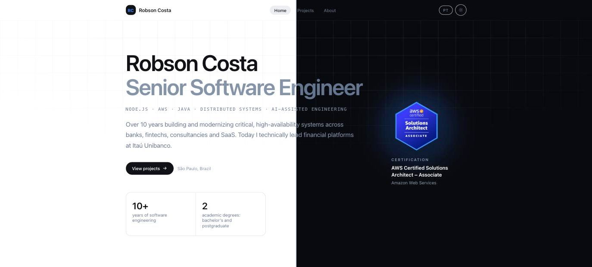

<h1 align="center">Personal Site</h1>

<p align="center">
  The personal site and engineering portfolio of Robson Costa, Senior Software Engineer.<br />
  Bilingual, statically generated by a Node script, served from GitHub Pages.
</p>

<p align="center">
  <a href="https://robsonx4.github.io"><strong>robsonx4.github.io</strong></a>
</p>

<p align="center">
  <a href="https://github.com/robsonx4/robsonx4.github.io/actions/workflows/deploy.yml">
    
  </a>
  
  
  
</p>



---

## About

Twelve pages of writing about software: who I am, the stack I work with, and three product case studies covering context, challenges, approach, architecture, results and what I learned. Everything is available in Portuguese and English.

There is no framework here, at build time or at runtime. `build.mjs` imports the content, renders each page with template literals and writes static files. The browser gets HTML, one hand-written stylesheet and 2.7 kB of JavaScript. Nothing hydrates.

| | |
| --- | --- |
| Transferred, home page | **12.9 kB** — 5.7 kB HTML, 6.3 kB CSS, 0.9 kB JS |
| Transferred, case study | **16 kB** |
| Runtime dependencies | **0** |
| Build dependencies | **1** (`sharp`, for image generation only) |
| Build time | **~15 ms** for 12 pages |
| Source, excluding content | **~2,400 lines** |

## Table of contents

- [Requirements](#requirements)
- [Quick start](#quick-start)
- [Scripts](#scripts)
- [Project structure](#project-structure)
- [How it works](#how-it-works)
- [Content](#content)
- [Quality checks](#quality-checks)
- [Accessibility and browser support](#accessibility-and-browser-support)
- [Deployment](#deployment)
- [Design decisions](#design-decisions)
- [Contributing](#contributing)
- [License](#license)

## Requirements

Node.js 22 or newer. Nothing else.

## Quick start

```bash
git clone https://github.com/robsonx4/robsonx4.github.io.git
cd robsonx4.github.io
npm install
npm run dev
```

Open <http://localhost:3000/pt> or <http://localhost:3000/en>. The dev server builds the site, serves `dist/`, watches `src/` and `public/`, and reloads the open tab on every change.

The root path `/` only exists in a build: it is a small redirector that picks the language from the browser.

## Scripts

| Script | What it does |
| --- | --- |
| `npm run dev` | Dev server with rebuild and live reload |
| `npm run build` | Build the site into `dist/` |
| `npm run check` | Build, then validate the output. This is what CI runs |
| `npm run images` | Regenerate the favicon set and Open Graph cards in `public/` |

## Project structure

```
build.mjs                  renders every page and writes dist/
dev.mjs                    static server, file watcher, live reload
src/
  content/site.js          all copy and data, PT and EN
  content/ui.js            interface labels
  lib/html.js              tagged template that escapes by default
  lib/i18n.js              language helpers
  lib/config.js            site URL and base path
  ui/layout.js             document shell, header, footer
  ui/parts.js              section, stack grid, project card, gallery, ...
  pages/                   home, about, projects, case
  styles/app.css           the entire design system, hand written
  assets/app.js            everything the browser runs
scripts/
  check.mjs                validates the built site
  generate-images.mjs      favicon and Open Graph cards from the content
public/                    images, logos, favicons
docs/                      assets for this README
```

## How it works

### Rendering

A page is a function that returns a string. `build.mjs` holds the list of pages as data, so adding a route means adding an entry, not configuring a router.

```js
list.push({
  path: to('/about', lang),
  lang,
  title: `${ui.nav.about[lang]} · ${profile.name}`,
  description: profile.tagline[lang],
  body: about(lang),
});
```

Every page is written to `dist/<lang>/<route>/index.html`, alongside the sitemap, `robots.txt`, the language redirector and a 404 page.

### Escaping

`src/lib/html.js` is a tagged template that escapes every interpolated value and lets nested templates through untouched. That is the one safety guarantee a framework normally provides, and it costs 25 lines.

```js
html`<p class="prose">${project.summary[lang]}</p>`
```

### Styling

`src/styles/app.css` is written by hand and shipped as written, with no compiler in between. Colors are declared once as custom properties and swapped in a single `.dark` block, so no rule in the file mentions a theme. Per-category and per-project accents come from one attribute:

```css
[data-tone='emerald'] { --tone: #10b981; }
.stack-icon { background: color-mix(in srgb, var(--tone) 12%, transparent); }
```

### Runtime JavaScript

`src/assets/app.js` is 65 lines and handles four things: the header shadow on scroll, the mobile menu, the theme toggle and the entrance animation. The theme itself is applied by an inline script in `<head>`, before first paint, so there is no flash of the wrong background.

The stylesheet and the script carry a content hash in their filename, so they can be cached indefinitely and still update on deploy.

## Content

All copy lives in two files. Templates never hardcode text.

- **`src/content/site.js`** holds the profile, bio, stack, experience, education, certifications and the full case studies. Every user-facing string is an object with `pt` and `en` keys. The shapes are documented as JSDoc typedefs at the top of the file, so editors still autocomplete them.
- **`src/content/ui.js`** holds interface labels: navigation, section titles, buttons.

### Adding a project

Append an object to the `projects` array in `src/content/site.js`. The listing, the home cards, the case page and the sitemap entries are all derived from it.

### Provenance

Profile, experience, education and the Gerencert results were confirmed against LinkedIn on 2026-08-31. The Gerencert technical detail comes from that project's own documentation, read on 2026-09-02. The YellowJobs and Moosy cases use product facts published on yellowjobs.com.br and moosy.app plus the engineering narrative behind them. Product screens under `public/projects/` come from those sites.

### Generated images

`favicon.svg`, `favicon-32.png`, `apple-touch-icon.png`, `og-pt.png` and `og-en.png` are produced from the name, initials, role and specialties in the content file. After changing any of those, or the brand color, run `npm run images` and commit the result.

Institution logos and the AWS certification badge live in `public/logos/`, referenced from the `logo` and `badge` fields in the content.

## Quality checks

`npm run check` builds the site and then asserts, against the generated files:

1. Every declared page, the language redirector and the 404 page exist.
2. Every page has a title, a description, a canonical link, both `hreflang` variants, an Open Graph image and structured data, and declares the right `lang`.
3. No `undefined`, `[object Object]` or unresolved `${` leaked into the HTML.
4. Every internal link and asset reference resolves to a real file.
5. Both languages produce the same number of pages.
6. No file exceeds the 512 kB budget.

This is the trade for not running a type checker. TypeScript could not see inside template strings either, and a broken link is the mistake actually worth catching here.

## Accessibility and browser support

- Semantic landmarks, a skip link, `aria-current` on the active nav item and labelled icon buttons.
- Entrance animations only exist once a `.js` class lands on `<html>`. Without JavaScript, or with `prefers-reduced-motion`, everything is visible immediately and every link works.
- Focus is always visible.
- Theme follows the system preference until the visitor chooses otherwise.
- The CSS uses `color-mix()` and custom properties, supported by every major browser since 2023.

## Deployment

Every push to `main` triggers [`.github/workflows/deploy.yml`](.github/workflows/deploy.yml), which installs, runs `npm run check` and publishes `dist/` to GitHub Pages. The repository is configured with **Source: GitHub Actions**.

The site URL defaults to `https://robsonx4.github.io` and the base path is empty. To move to a custom domain:

1. Add `public/CNAME` containing the domain.
2. Set the `SITE_URL` repository variable to the new origin.

`BASE_PATH` only needs a value if the site is ever served from a subdirectory.

## Design decisions

- **A script, not a framework.** Twelve pages of mostly static text. A build script that returns strings is smaller than the configuration a framework would need, and the whole thing is readable in one sitting.
- **Content as data.** Case studies are plain objects, so one source feeds the home, the listing, the case pages, the sitemap and the structured data.
- **Escaping by default.** The only real footgun of string templating, removed in 25 lines.
- **Tokens, not utility classes.** One stylesheet with semantic class names and CSS custom properties. Dark mode is a token swap, not a variant on every rule.
- **Progressive enhancement.** The site is complete without JavaScript; the script only adds comfort.
- **Checks over types.** Assertions against the built output catch the mistakes that actually happen here.
- **SEO baseline.** Per-language canonical and `hreflang`, Open Graph and Twitter cards with generated images, a `Person` JSON-LD block, sitemap and robots.

## Contributing

This is a personal site, so pull requests changing its content are not expected. Bug reports about the build, the checks or the markup are welcome as issues, and the approach is free to copy.

## License

No open-source license is granted. The code is published as a reference and may be read and adapted; the written content, images, logos and personal information are not licensed for reuse.
